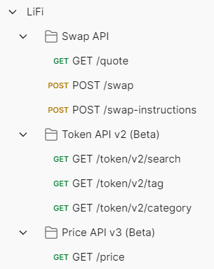
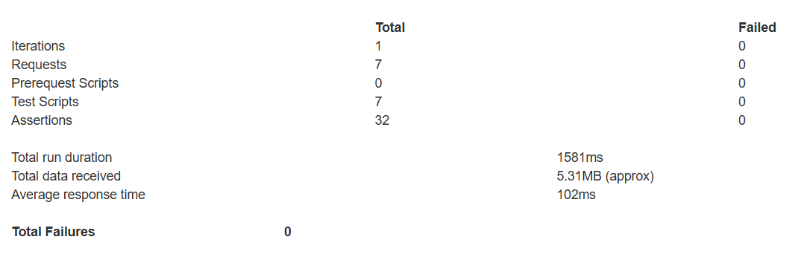

## **Deliverables**

1. **Test Plan** — Scope and objective, approach, test cases, test data, risks
Scope and objective : The scope of this assignment is to test below API covering positive, negative, edge case, error scenarios

Approach : Perform different type of testing for API - Functional, Automation, Performance

Test Cases : Refer LIFI Test Cases.xlsx sheet covering Test Cases for respective API endpoint

Test data : Tested with popular tokens like Sol, USDC

Risks : API endpoint does not require authentication, it can be misused, brining down Production environment infrastructure

2. **Test Suite** — Postman collection, code files, GitHub repo, etc
Postman collection, code files : Files are attached 
LiFi.postman_collection.json - contains all API endpoints and test cases
LiFi.postman_environment.json file- contains environment variable example baseURL value

Test Data has been parameterised avoiding hardcoded values example - baseURL, inputMint, outputMint

3. **Reports** — Below is the screenshot of Test results

4. Setup & execution instructions : Postman collection and Environment file is present in repo. To run test in local, download Postman, import the LiFi.postman_collection.json file and LiFi.postman_environment.json file in postman and click on Run. 
5. CI/CD workflow has been integrated using Github Actions.